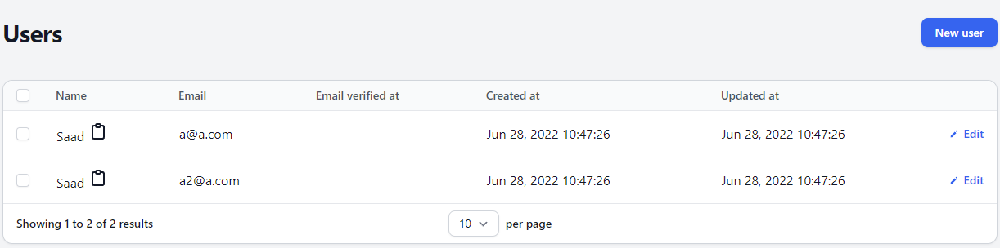

# Filament Copyable

Copyable Text Columns and Fields for Filament PHP.



## Installation

You can install the package via composer:

```bash
composer require saadj55/filament-copyable
```
## Usage

In in your Table Schema:

```php

\Saadj55\FilamentCopyable\Tables\Columns\CopyableTextColumn::make('name')

```
## License

The MIT License (MIT). Please see [License File](LICENSE.md) for more information.
