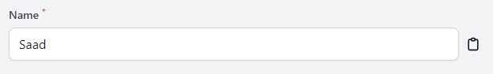

# Filament Copyable

Copyable Text Column and Field for Filament PHP.




## Installation

You can install the package via composer:

```bash
composer require saadj55/filament-copyable
```
## Usage
### Column
In in your Table Schema:

```php

\Saadj55\FilamentCopyable\Tables\Columns\CopyableTextColumn::make('name')

```
You can make the icon to only appear on hover with the `->showOnHover()` method, 

You can set a custom [heroicon](https://heroicons.com/) by using the `->icon('heroicon-o-duplicate')` method.

### Field

```php

\Saadj55\FilamentCopyable\Forms\Components\CopyableTextInput::make('name')

```
## License

The MIT License (MIT). Please see [License File](LICENSE.md) for more information.
